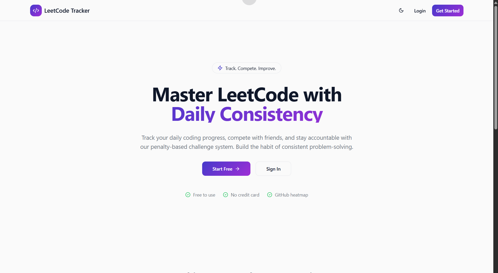

# Code Duel Frontend

<div align="center">
   
</div>

A sleek, modern web application designed to help developers stay consistent with their LeetCode practice. Compete with friends, track your daily progress, and stay accountable through a structured challenge system.

## 🚀 Overview
LeetCode Tracker is a full-stack platform where users can join or create coding challenges. The system monitors your LeetCode submissions and evaluates your daily performance based on pre-defined targets.

### Key Features
- **Mobile-Responsive Design**: Fully accessible on all devices with a dedicated mobile navigation drawer.
- **Challenge Management**: Create challenges with custom rules, daily targets, and penalty systems.
- **Leaderboards**: Real-time rankings to stay competitive with peers.
- **Activity Heatmaps**: Visual representation of your coding consistency.
- **Dark Mode**: Eye-friendly interface with dynamic theme switching.


## 🛠️ Tech Stack

<div align="center">

|  | Technology |
| :---: | :--- |
|  | **Frontend Framework:** [React 18](https://reactjs.org/) |
|  | **Build Tool:** [Vite](https://vitejs.dev/) |
|  | **Language:** [TypeScript](https://www.typescriptlang.org/) |
|  | **Styling:** [Tailwind CSS](https://tailwindcss.com/) |
|  | **UI Components:** [shadcn/ui](https://ui.shadcn.com/) |
|  | **Icons:** [Lucide React](https://lucide.dev/) |
|  | **Date Handling:** [date-fns](https://date-fns.org/) |
|  | **API Client:** [Axios](https://axios-http.com/) |

</div>


## 📦 Getting Started

### Prerequisites
- [Node.js](https://nodejs.org/) (v18 or higher)
- [npm](https://www.npmjs.com/) or [pnpm](https://pnpm.io/)

### Installation
1. **Clone the repository:**
   ```bash
   git clone https://github.com/gdg-charusat/Code_duel_frontend.git
   cd Code_duel_frontend
   ```
2. **Install dependencies:**
   ```bash
   npm install
   # or
   pnpm install
   ```

### Environment Configuration
Create a `.env` file in the root directory and add the following:
```env
VITE_API_URL=http://localhost:3000
```

### Running Locally
To start the development server:
```bash
npm run dev
```
The app will be available at [http://localhost:8080](http://localhost:8080).


## 📂 Project Structure

```
Code_duel_frontend/
│
├── public/
│   ├── assets/                # Static images and assets (e.g., screenshots)
│   ├── favicon.ico            # App favicon
│   └── robots.txt             # Robots exclusion file
│
├── src/
│   ├── components/            # Reusable UI components
│   │   ├── challenge/         # Challenge-related components
│   │   ├── common/            # Common/shared UI elements
│   │   ├── dashboard/         # Dashboard widgets and charts
│   │   ├── layout/            # Layout and navigation (Navbar, Layout)
│   │   ├── leaderboard/       # Leaderboard table and related UI
│   │   └── ui/                # Base UI primitives (shadcn/ui)
│   ├── contexts/              # React Contexts (Auth, Theme)
│   ├── data/                  # Static/mock data
│   ├── hooks/                 # Custom React hooks
│   ├── lib/                   # API config and utility functions
│   ├── pages/                 # Page-level components (routes)
│   ├── types/                 # TypeScript type definitions
│   ├── App.tsx                # Main App component
│   ├── main.tsx               # App entry point
│   └── index.css              # Global styles
│
├── .github/                   # GitHub workflows and templates
├── package.json               # Project metadata and dependencies
├── tsconfig.json              # TypeScript configuration
├── tailwind.config.ts         # Tailwind CSS configuration
├── postcss.config.js          # PostCSS configuration
├── vite.config.ts             # Vite configuration
├── README.md                  # Project documentation
└── ...                        # Other configs and docs
```

### Key Directories
- **components/**: All UI building blocks, organized by feature and type.
- **pages/**: Top-level route components for each page.
- **contexts/**: Global state management using React Context API.
- **lib/**: API utilities and helper functions.
- **hooks/**: Custom React hooks for reusable logic.
- **types/**: TypeScript type definitions for strong typing.
- **public/assets/**: Static images, screenshots, and icons.

---


## 🤝 Contribution Workflow
1. **Fork the Project** on GitHub ([How to fork a repo](https://docs.github.com/en/get-started/quickstart/fork-a-repo)).
2. **Create your Feature Branch:**
   ```bash
   git checkout -b feature/YourFeatureName
   ```
3. **Commit your Changes:**
   ```bash
   git commit -m 'feat: add YourFeatureName'
   ```
4. **Push to the Branch:**
   ```bash
   git push origin feature/YourFeatureName
   ```
5. **Open a Pull Request** ([How to create a PR](https://docs.github.com/en/pull-requests/collaborating-with-pull-requests/proposing-changes-to-your-work-with-pull-requests/creating-a-pull-request)).


## 📄 License
Distributed under the ISC License. See [LICENSE](LICENSE) for more information.

---

For more details, visit the [project repository](https://github.com/gdg-charusat/Code_duel_frontend).


